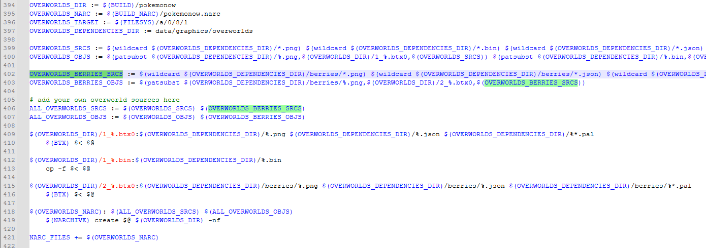

# Adding New Overworlds in HeartGold Engine
> Author: Senate

This guide will help you to add new overworlds in HeartGold Engine (HGE).

WARNING: HGE will continue to add more overworlds and more overworld graphics -- if you merge these into your project, make sure to update the GFX number that your overworlds start with (more on that later in the guide).

---

## Table of Contents
  - [Table of Contents](#table-of-contents)
  - [Acknowledgements](#acknowledgements)
  - [Prerequisites](#prerequisites)
  - [BTX0 File Overview](#btx0-file-overview)

---

## Acknowledgements
BluRose: All the help in teaching me this and making this possible in HGE.

---

## Prerequisites
- Cloned HGE repository -- refer to the setup guide found here: (https://github.com/BluRosie/hg-engine)
- Sprite editing software, e.g. Aseprite and something to [index the sprite with](../../../universal/guides/sprite_indexing/sprite_indexing.md)
- DSPRE (https://github.com/AdAstra-LD/DS-Pokemon-Rom-Editor)

---

## BTX0 File Overview

HGE recently added the ability to construct all of the `BTX0` files directly from files in a manner that matches 1:1 with the vanilla overworlds.

As a result, all of the vanilla NPC's and files are dumped to HGE's [`data/graphics/overworlds`](https://github.com/BluRosie/hg-engine/tree/main/data/graphics/overworlds) folder.  This allows for easy editing and expansion.

The `BTX0` file format specifies a number of frames that pull from an overall texture at the end of the file.
There are also palettes specified for these images to take, making the `BTX0` be a sort of all-in-one container for animated palettes that combines NCGR, NCLR, and somewhat flipbook animation files.
We dump these to editable formats, specifically a JSON for metadata, a png for the entire texture, and a series of JASC-PAL files as stipulated in the metadata.
The PNG is 4bpp (16 colors) and is enforced as such.  Most sprites are fine with one JASC-PAL file, and there is one that is prefixed with the same number as the png and JSON files.  Following Pokémon have two palettes (and a few others do as well)--an additional one for the shiny palette.
The image must be indexed to both palettes--this is to say that the order of the colors must be the same.  **The best program in my opinion to reconcile palette data with the image and converting images to the proper format is [Irfanview](https://www.irfanview.com/).**

---

## Practically Editing Files for the BTX0

The easiest way to edit a BTX0 for a new overworld is to replace its image and export the palette over the JASC-PAL that is has already, leaving the name and such similar.  The JSON that stores the metadata need not be edited at all and can be copied to a new entry just fine, copying it and renaming to a different number (as well as the PNG texture and the palette file associated with the JSON).

---

## Expanding The Overworld Table

At the top of ``../src/field/overworld_table.c`` with the definitions for shadows, include the following code:

```c
#define NEW_NPC_START 7000
#define NEW_NPC_GFX_START 2000 // exact number may depend--it is the number of the first overworld gfx that is not used in the overworld table
#define NEW_NPC_ENTRY(num) {.tag = NEW_NPC_START + num, .gfx = NEW_NPC_GFX_START + num, .callback_params = 0}
```

You can choose what ``NEW_NPC_START`` is defined as, but choose an arbitrarily large number that HGE will likely not reach. This ensures that your overworld entry will not be shifted later in your project, which would make for an extremely tedious process of updating your overworlds in DSPRE.

Notably, it should not be higher than 8192.  For most purposes, a solid 7000 will suffice.

As mentioned at the beginning of this guide, you will have to change ``NEW_NPC_GFX_START`` as HGE adds more overworld sprites. At the time of writing this guide, 1457 is the last used GFX, which belongs to the three segment form of Dudunsparce. Make sure you pay attention to what the last number used by HGE is as you merge!

After the Pokémon overworlds, include the following:

```c
NEW_NPC_ENTRY(0), // the name of your sprite for easy reference
```

So that it will look like:

```c
(...)
{ .tag = 1789, .gfx =  297, .callback_params = OVERWORLD_SIZE_SMALL}, // SPECIES_IRON_BOULDER
{ .tag = 1790, .gfx =  297, .callback_params = OVERWORLD_SIZE_SMALL}, // SPECIES_IRON_CROWN
{ .tag = 1791, .gfx =  297, .callback_params = OVERWORLD_SIZE_SMALL}, // SPECIES_TERAPAGOS
{ .tag = 1792, .gfx =  297, .callback_params = OVERWORLD_SIZE_SMALL}, // SPECIES_PECHARUNT

NEW_NPC_ENTRY(0), // the name of your sprite for easy reference
```

You have now expanded the overworld table to fit yours!

---

## Compiling

If you were to compile now, you would successfully have a new entry in the overworld table in DSPRE, but your sprite would not show up. This is due to HGE not rebuilding ``a/0/8/1`` without being told to do so.

To fix this, we can add a Make option in ``narcs.mk`` to update ``a/0/8/1`` during the build process. Add this in ``narcs.mk``:

```makefile
# add make option for rebuilding overworlds
reset_overworlds:
    rm -rf build/a081
    rm build/narc/pokemonow.narc
```
Additionally, you will need to add the following in ``narcs.mk`` near ``OVERWORLDS_DIR := $(BUILD)/pokemonow``:

```makefile
OVERWORLDS_NEW_NPCS_SRCS := $(wildcard $(OVERWORLDS_DEPENDENCIES_DIR)/new_npcs/*.png)
OVERWORLDS_NEW_NPCS_OBJS := $(patsubst $(OVERWORLDS_DEPENDENCIES_DIR)/new_npcs/%.png,$(OVERWORLDS_DIR)/4_%,$(OVERWORLDS_NEW_NPCS_SRCS))
$(OVERWORLDS_DIR)/4_%:$(OVERWORLDS_DEPENDENCIES_DIR)/new_npcs/%.png
	$(BTX) $< $@
```
It should end up looking like this:



Finally, add ``$(OVERWORLDS_NEW_NPCS_OBJS)`` to the ``$(OVERWORLDS_NARC): | overworld_extract $(OVERWORLDS_OBJS) $(OVERWORLDS_NEW_BERRIES_OBJS)`` line near ``remove binaries:`; i.e.:

```makefile
remove_binaries:
	for n in $$(seq 297 $$(expr $$(ls $(OVERWORLDS_DIR) | wc -l) - 1)); do rm -f $(OVERWORLDS_DIR)/1_$$(printf "%04d" $$n); done

$(OVERWORLDS_NARC): | overworld_extract $(OVERWORLDS_OBJS) $(OVERWORLDS_BERRIES_OBJS) $(OVERWORLDS_NEW_NPCS_OBJS) remove_binaries
```

Now, all that's left to do is run ``make reset_overworlds`` before you compile your ROM with ``make``.

You're done!

---

You can also apply this to porting overworlds from DPPt if you'd like.
