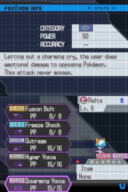
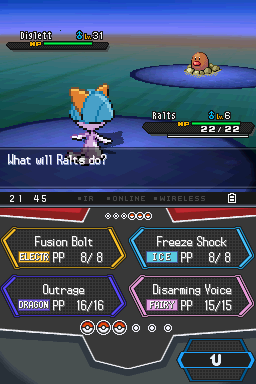
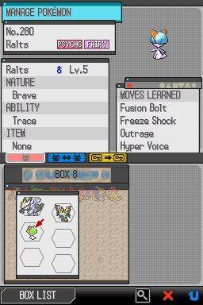

# Fairy Type in B2W2
> Author(s): [BluRose](https://github.com/BluRosie) <br />
> Research: [BluRose](https://github.com/BluRosie), [MeroMero](https://www.pokecommunity.com/showthread.php?t=349000)

This is a tutorial that details how to insert the Fairy type in Black 2 and White 2 using MeroMero's [initial research from years ago](https://www.pokecommunity.com/showthread.php?t=349000) and building upon it with a new and improved better understanding of just what happens in the assembly.  While yet imperfect, the improvements allow for a much better Fairy representation overall, eliminating the appearance of glitched graphics and crashes entirely.

---
## Table of Contents
- [Fairy Type in B2W2](#fairy-type-in-b2w2)
  - [Table of Contents](#table-of-contents)
  - [Graphics](#graphics)
    - [Type Icons - ``/a/0/8/2``, ``/a/1/2/5``](#type-icons---a082-a125)
    - [Move Selection Palette - ``/a/0/1/1``](#move-selection-palette---a011)
    - [Hall of Fame Palette - ``/a/2/1/3``](#hall-of-fame-palette---a213)
  - [Code - ASM File](#code---asm-file)
  - [Cleanup](#cleanup)
  - [TODO](#todo)

## Graphics
Various other type graphics are leftover from possible features.  We look to replace those here.

### Type Icons - ``/a/0/8/2``, ``/a/1/2/5``
Here we replace the Cool and ??? type icons with the Fairy type icon to allow us to print the icon.  Tinke allows us to do this by replacing the relevant files, first in ``/a/0/8/2``: 

[a082_33.RLCN](resources/a082_33.RLCN) and [a082_51.RGCN](resources/a082_51.RGCN) should replace the ones in the ROM from an extracted ``/a/0/8/2``.

This replaces  with 

Similarly in ``/a/1/2/5``, we just replace the ??? type icon at the bottom of an image to now be the Fairy type, replacing the files in ``/a/1/2/5`` with [a125_22.RLCN](resources/a125_22.RLCN) and [a125_23.RGCN](resources/a125_23.RGCN)

This replaces  with .

### Move Selection Palette - ``/a/0/1/1``
Here we add a new palette to ``/a/0/1/1`` to make Fairy moves appear as pink in the move selection screen.

This file is [a011_572.RLCN](resources/a011_572.RLCN).

``a011`` originally just has 571 files.  We add a 572nd file for our purposes.  You can either unpack/repack using narchive (included in the b2w2-fairy repository) or Extract directory using Tinke, add the file, and Change by directory using Tinke again.  

### Hall of Fame Palette - ``/a/2/1/3``
Here we add a new palette to ``/a/2/1/3`` to make Fairy Pokémon show up in the Hall of Fame with a pink nameplate.  This is currently bugged and unfinished, but once the code is written it will be fixed in the Git repo.

The file to replace with once extracted:  [a213_9.RLCN](resources/a213_9.RLCN)

## Code - ASM File
I have made a [repository](https://github.com/BluRosie/b2w2-fairy) which should be downloaded as-is that has the fairy type code and is maintained as such.  Any additions or changes (future bugfixes!) will be included there.

All you *need* to do is follow the instructions there, abridged here (currently for Windows only):
- Place your White 2/Black 2 ROM in the base folder (`b2w2-fairy-main`) as `base.nds`
- Read and modify the configs at the beginning of `asm\fairy.s`.  The only one that should really be changed is `BLACK2` being `1` if you are applying to Black 2, and `0` if applying to White 2.
- Double click on the `applyfairytype.bat` batch file
  - A script will run that applies all the Fairy type code changes to copied overlay files and recompresses them in the base folder for ROM insertion
- Open `base.nds` in Tinke
- "Change file" all of overlays 167, 168, 207, 255, 265, the overlay table (y9.bin), and the arm9
- Save your ROM as some other named file

<details>
<summary>Documentation - Code Changes</summary>

<br />

<b>Overlay 167</b>

This overlay hosts the type chart.  All the edits made to this overlay are for adjusting the type chart.  The type chart declaration is
```c
const u8 gTypeEffectiveness[NUM_OF_TYPES][NUM_OF_TYPES];

gTypeEffectiveness[atkType][defType] grabs the effectiveness of atkType when attacking defType
- 08 is super effective
- 04 is normal effective
- 02 is not very effective
- 00 is ineffective
```
So all of the code for accessing subsequent entries needs to take into account an extra element in each row and an extra column.

<br />

<b>Overlay 168</b>

This overlay hosts the move type -> move selection palette table.  We just write a 572 near the end of the file and leave it be to correspond to the newly created nclr in a011.

<br />

<b>Overlay 207</b>

This overlay handles a lot of the code for the summary screen.  We edit it to support the new type icon.

The old structure allocated for this was `0x264` in size, and at `0x130` it kept track of the type icon OAM id's or something like that.  I'm honestly not 100% certain what it is, but it maps something to the graphics.  This is a common theme with all of the type icon edits made.

First, we double the memory heap allocation size for the summary screen to give us freedom in messing with the structure.  We need to add an entry to the `0x130` structure.  This is an issue--it's baked into the overall structure.  We need to move it to the end of the old structure--we can do this by replacing the `0x130` entries that represent this with `0x264` and to increase the size of the allocated structure to begin with to allow for this moving.  How this is done is documented in the `asm\fairy.s` file.

<br />

<b>Overlay 255</b>

Similarly, the PC Screen has a structure `0xA5BC` in size.  At `0xA268` of this structure, the type icon OAM id's are stored once again.  This would be as simple as moving it to the end, but `0xA268` is actually just a part of a substructure that is baked into the overall structure that starts at `0x18C`.  At `0xA0DC` of this substructure, there is a massive array of OAM id's for every sprite that is possibly on screen.  This includes and captures the `0xA268` from the overall structure--so I end up writing a hook into that area that checks for the overall structure offset and will redirect it to the end if it's part of the type icons.

Whenever switching off of a Pokémon, the type icons are all deleted and and replaced--this is done by deleting all of the type OAM id's in a for loop.  There are two separate code areas that are run for these, one for switching onto a new Pokémon and another for switching into blank space.  These for loops are both expanded to run one more time for the Fairy type.

This new type then takes the tag of one of the boxes when "move Pokémon" is selected, so the box is then deleted instead of loaded in properly.  Need to look into moving the boxes to be one tag later.

<br />

<b>Overlay 265</b>

Here, the table `u32 type_to_loaded_gfx_hof[NUM_OF_TYPES]` exists to map the types to their loaded SPA file when the hall of fame cutscene happens.  This SPA is all of the particles that appear when the Pokémon slides on screen.  Similarly, the palette table is at the very end of the overlay, but currently assigning a valid palette causes a crash in the hall of fame.  As such, we currently just load an invalid palette to prevent the crash.

</details>

   

## Cleanup
From there, just make Struggle type 18 to make it typeless.  Assign all the Pokémon that need it to be Fairy type.  Make moves that have the Fairy typing as well.  It's now a functional type entirely!

## TODO
- Type icon in the Dex does not show up--pure fairy types don't have anything show up!  Does not crash, though.
- Hall of Fame palette loading--memory overflow or something?  Having it load nothing works fine, but appears as a black void.
- PC Screen tag overlap--fairy is loaded in the same sprite slot as one of the box icons and is both scrolled as such and the box icon doesn't show up in the menu.
