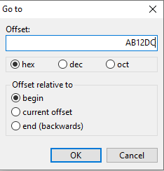
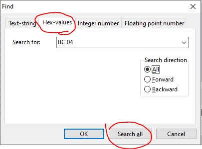

# Hex Editing
> Author(s): [SpagoAsparago](https://github.com/SpagoAsparago)

This is a tutorial on how to hex edit your files for the first time.

--- 
## Table of Contents
* [Using a Hex Editor](#section)
* [Offsets](#section-2)
   * [Different Game Languages](#subsection)
* [Searching the bytes](#section-3)
  * [Little Endian](#subsection-2)
* [Pasting bytes](#section-4)
* [Compressed files](#section-5)

## Using a Hex Editor

Binary Hacking is done by editing the compiled binaries of the game files. 
For most of the regular stuff like wild encounters and trainers there are tools in place to simplify the process, but sometimes it is still necessary to hex edit things manually.

If you haven't already you need to download a Hex Editor. There are plenty of different softwares that can do it, in this guide I will be using HxD.

To start, open the file you want to edit with it. Worth mentioning that you can open in a hex editor any file regardless of its extension, keep this in mind since narc files or their contents once extracted might not have an extension.

## Offsets

An offset is the address of a binary file.

In HxD you can "jump" to certain offsets using the *Search>Go To...* function, or using the shortcut `Ctrl+G`. It will open up a window where you need to enter the offset. Note that offsets are usually indicated with a `0x`, such as `0xAB12DC`, so in this case you only need to enter `AB12DC`.

### Different Game Languages
Generally all offsets will refer to the US version of the game in question, unless specified otherwise. Such offset might be different if you're using a non-English version of the game, but it's still possible to find the equivalent offset:

1) Go to the offset in the US version of the game
2) Copy 10 bytes or more
3) Open the equivalent file from the game version you want to edit
4) Search those bytes (see the next section). You should find only one result, which will be the equivalent offset If not, you need to copy more bytes and search again.

## Searching the bytes

When you need to instead search for a sequence of bytes (that you already know), you can use HxD Search function or the shortcut `Ctrl+F`, selecting Hex Values and then pasting the bytes you are looking for. 
Click *Search All* to display all the possible results.

### Little Endian

When it comes to binary all the data is stored in [little-endian format](https://thebittheories.com/little-endian-vs-big-endian-b4046c63e1f2):

To keep it simple, just remember that the order of bytes is always inverted. For example, if you want to search 1212, first convert it to hexadecimal (Windows Calculator programmer mode can come in handy): it will be `04 BC`, swapping the order of bytes we get the little endian number which is `BC 04` in this case.
Also, in HxD you can see the decimal value of the bytes you currently have selected (Make sure Little Endian is selected).

## Pasting Bytes

Once you are at the right offset you can simply type the bytes you want to replace and save the file, or use the Ctrl+B shortcut, which will overwrite the amount of bytes you have currently copied at the offset location. In HxD the bytes you edited before saving the file will be displayed in red.

**Remember to only replace bytes and never expand the size of the original file, unless you know what you are doing**.
The game expects an exact amount of data, generally expanding the size of the file will break your game unless you are also accounting for that trough code editing.

Don't forget to save the file after you're done hex editing!

## Compressed files
All games including HGSS and onwards have their overlay and arm9 files compressed. This is always going to be mentioned in all the guides you can read here but it's worth to keep it in mind:

* You can use CrystalTile2 to decompress and then reinsert (once edited) the arm9 and overlays
* For gen 4 games, the arm9 in the PokEditor and DSPRE project folder is already uncompressed. For HGSS, you can uncompress Overlay 1 using DSPRE's toolbox. You can find all the compressed overlays in the project folder.
* For gen 5 games, the arm9 in the CTRMap project folder is already uncompressed. If you insert a uncompressed overlay in the appropriate subfolder, you can pack and then export the ROM without recompressing it.
* [blz](https://www.romhacking.net/utilities/826/) can be used to decompress and recompress arm9 and overlays. This is a **command line tool**, you don't double click on it. Put blz.exe and the file you need to compress/uncompress in the same folder, open the cmd from that folder and then run the appropriate command. You can see the available commands by running the `blz` command.
* Overlays and arm9 extracted with Tinke are always compressed. If you decompressed it afterwards, you'll need to hex edit the overlay table to insert it with Tinke again.
