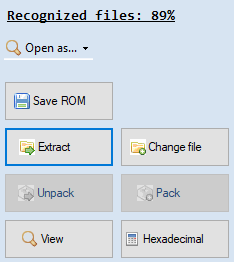
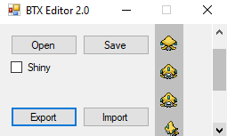
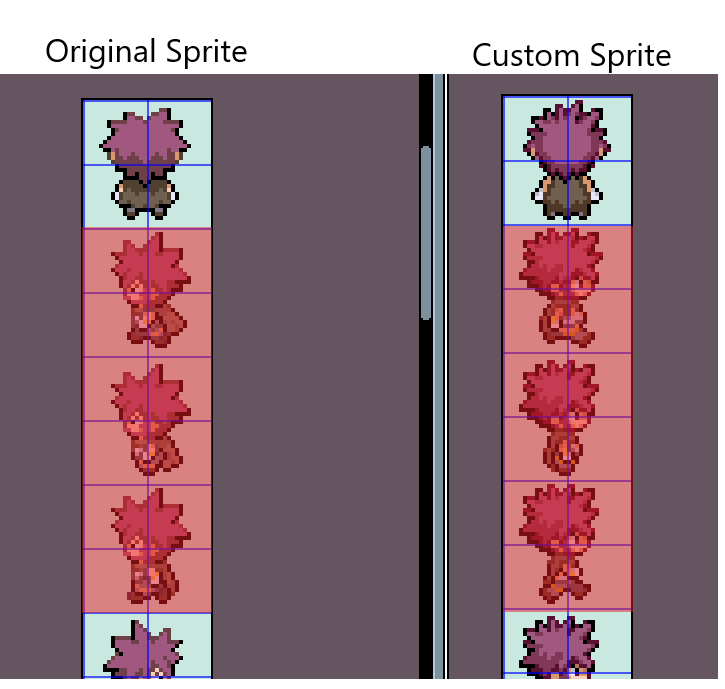
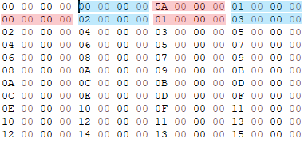
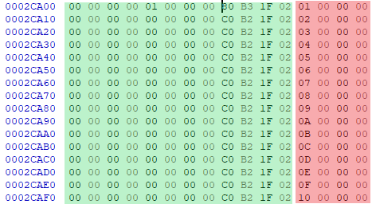

# Overworld Sprite Replacement Guide
> This guide was written by SpagoAsparago. Credits to the [Known Sprite Locations document](https://docs.google.com/document/d/1_nRfhDEoNFbvYP-yjx4oAWmgGXxvqFBvLwYANFehxUU/edit) and BagBoy for the OW tables research.

This is a guide on how to extract, replace, change the properties and make your own overworld sprites.
The necessary tools are Tinke 0.9.2 and BTX Editor 2.0

In addition for the Sprite Properties section you will need DSPRE and an Hex Editor like HxD as well.

--- 
## Table of Contents
* [Extracting the Sprite](#section)
* [Making your own Sprite](#section-2)
* [Replacing](#section-3)
  * [Unused Sprites](#subsection)
* [Changing the Sprite Properties](#section-4)
  * [Platinum](#subsection-2)
  * [HGSS](#subsection-3)

## Extracting the Sprite
Overworld sprites are contained in BTX files, start by opening your ROM with Tinke and then navigating to the following filepath depending on your game:
* **DPPt**: mmodel/mmodel.narc
* **HGSS**: a/0/8/1

Once you've navigated to this directory in Tinke, select the narc file and click unpack to see see all the BTX files. 
You can select one and click the "View" button to see the spritesheet. Select the one you want to replace and click Extract, so that you will obtain the BTX file.

You can load this file in the BTX Editor 2.0 to either extract the spritesheet itself in a .png format or import your own spritesheet.

 
Where to find all Player Character Sprites.

 

   Diamond and Pearl
   Lucas:
		90 - Walking/Running
		92 - Bike
		155 - Pull out Pokeball
		157 - Water flower
		159 - Surf
164 - Tux
166 - Fishing
363 - Aerobics
365 - Save
367 - Pokecenter

Heroine:
91 - Walking/Running
		93 - Bike
		156 - Pull out Pokeball
		158 - Water flower
		160 - Surf
165 - Dress
167 - Fishing
364 - Aerobics
366 - Save
368 - Pokecenter

  

## Making your own Sprite
Before proceeding you should be familiar with Sprite Indexing, as all the sprites must have at most 16 color, with the background color being indexed to the first slot of the palette.
See [Sprite Indexing](kingdom-of-ds-hacking.github.io/tree/main/src/universal/guides/sprite_indexing) for more information.

First you want to load the png spritesheet you previously extracted in the graphic editing software of your choice, to either make edits to it or use it as a base for your spritesheet. 
You may also want to enable some kind of grid visualization in order to view the proper position of each frame. In Aseprite you can do so by clicking View>Grid>Grid Settings.

If you're making your own sprite from scratch, remember that all the frames you draw must be in the same position as the ones in the original sprite, otherwise the movement in game will look wrong; for example the following image is not a correct spritesheet since the three walking frames aren't in the same position as the original one:

Once you're done, you can open the BTX you previously extracted in BTX Editor 2.0 and click import, then import the spritesheet you made, and save the BTX.

## Replacing the Sprite
Replacing the sprite simply consists in just clicking the "Change File" button in Tinke on the BTX file you want to replace, and then select the BTX you either extracted or obtained from BTX Editor. Don't forget to **click the Pack button on the narc file** after you've replaced the BTX. Now you can save the ROM.

Just remember that the sprite you're inserting must have the same size and number of frames as the one you're replacing, otherwise you will have to change its properties to get the movement working correctly even if it's the same size. Single-frame sprites with the same dimension as the original won't have the issue however.

### Unused Sprites
Adding new overworld sprites would require ASM but luckily there are a number of unused sprites that may be useful to you:

## Changing the Sprite Properties
If you've replaced a sprite with one having a different number of frames or a different size, the sprite will either not display correctly in game or not display at all if it has a different size. 
Unless your sprite is only made of one frame and has the same size the original one, you will need to fix this by hex editing each sprite properties. If you haven't already open your ROM in DSPRE so you can easily access the necessary overlay files in the folder created by DSPRE, which will be named *YourROMName*_DSPRE_Contents/overlay. 

All the offsets listed are based on the US version of the ROM and it has not been tested on other versions.

### Platinum
In Platinum there are two tables we need to look up for changing sprite properties, both are in Overlay 5.

First we need to find the ID number of the sprite we previously replaced. For my example I'll use the unused Rotom Oven, whose model number is 406, and I have replaced it with a 64x64 Ho-Oh Sprite ripped from HGSS, having two frames:

The first table is at 0x2BC34 and will look like this:

Each entry is made of 8 bytes, the first 4 in red for the ID number and the latter 4 in blue for the mmodel number. We already know the model number, which in little endian is 96 01, so we just need to search those bytes using HxD search hex values function with the search direction being set to "forward", then click Search All.
Since my mmodel number is greater than 255, I'll get a single result, being the two bytes corresponding to the model number, the next 2 bytes are going to be 00 00 and the next 4 bytes are the ID number we are looking for, in my case F4 00 00 00.

If your model number was less than or equal to 255, **you need to look at the second result in the results tab**.

With this information we can go to the second table at 0x2CA08, which is structured like this:

Each row is an entry, the bytes in the red columns are the ID numbers of each sprites and the bytes in green are the sprite properties. You can scroll down until you see the ID number from the 1st table in the red columns. The bytes you want to edit are right before the ID number, in my case it will be which is a standard 32x32 16 frames NPC.
 
The bytes you want to replace for this are going to be depending on which Sprite Property you want to have:

| Byte Sequence  | Corresponding Property | Example |
| ------------- | ------------- |  ------------- |
| 00 00 00 00 00 00 00 00 C0 B2 1F 02 | 32x32 Sprite with 16 frames | Regular NPCs |
| 05 00 00 00 00 00 00 00 C0 B2 1F 02 | 64x64 Sprite with 2 frames  | DPPt larger Legendaries like Palkia and Dialga |
| 0B 00 00 00 15 00 00 00 64 B1 1F 02 | 128x64 Sprite with 2 frames  | DPPt Giratina Distortion World sprite |

You can paste them with Ctrl+B in the green section of the row shown above. Then, save the overlay and save the ROM from DSPRE. If you have done the process correctly, it will show up in game.
If the two frames are different you can set the OW movement to *20-Running Up, Down* in DSPRE event editor to have the animation play out costantly.

### HGSS
Fortunately in HGSS there is only one table, it's at offset `0x21BA8` in Overlay 1.
The Overlay 1 needs to be uncompressed, so you either have to use blz to decompress it or apply the *Configure Overlay 1 as uncompressed* patch from DSPRE's toolbox.
I will be replacing the glitched bulbasaur sprite with a standard 32x32 NPC, so first I need to find the correspondent ID number.
The table will look like this: 

There are 6 bytes for each entry, with the first two bytes (red) are the Overworld ID, the following two bytes (blue) for the number of the BTX filename in the a/0/8/1 narc, and the last two bytes (green) for the sprite properties.

The glitched Bulbasaur sprite I'm replacing is 1_201.BTX0, so in little endian the filename number I'm looking for is `C9 00`. We can find the corresponding result by searching those bytes with HxD search function, with search direction set *forward* and clicking *Search All*, and we have to look for the 2nd result if it exists (regardless if the number is smaller or greather than 255), which will be at `0x22EC4` in my case. The bytes I'm looking for are the next two, so at `0x22EC6`, and you will need to replace them with `00 00` for the standard 32x32 NPC.

So I will replace the `25 4E` bytes with `00 00`. You can save the overlay 1, and then save the ROM in DSPRE. If you did all the steps correctly the sprite you replaced will show up correctly in game.
The other two offsets to fix the remaining bulbasaur glitched sprites (1_202.BTX0 and 1_203.BTX0) are respectively at `0x22ECC` and `0x22ED2`.
