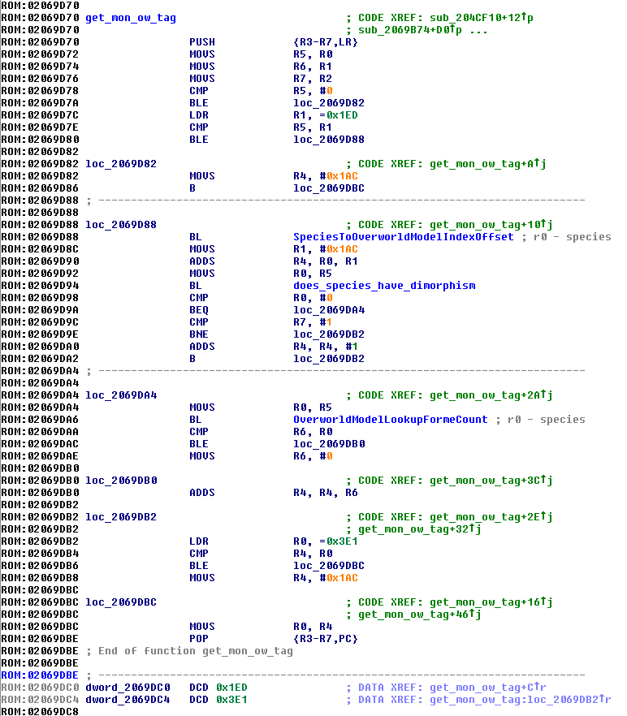
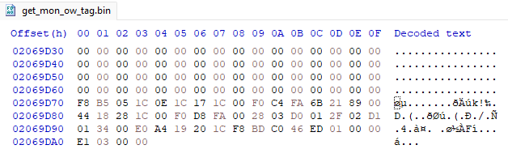
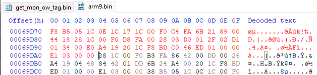

# Code Injection Tutorial <sup>*(Platinum/HGSS)*</sup>
> All research for this guide & the writing was done by [BluRose](https://github.com/BluRosie).  A bit was also done by [Mikelan98 and Nomura](https://pokehacking.com), particularly the [synthetic overlay handling](https://pokehacking.com/tutorials/ramexpansion/).

This tutorial is intended for those who already at least somewhat know ARM assembly.  ARM assembly is basically the same anywhere as it is here--feel free to use whatever online resource to learn how to program in ARM assembly and C to be prepared for this tutorial.

Code injection is the process of highjacking program execution from an already set-in-stone ROM code binary file and running custom code from there.  The ROM is by and large unmodified--we are not using a shiftable disassembly.

This is typically a very tedious process that is not very clear to newcomers and even people who are used to having the entire codebase at their fingertips.  The code that is written for code injection is inherently constrained by the already-existing assembly, and the state that we branch off from by and large needs to be restored to ensure that program execution is restored and continues to run smoothly.  Not only that, redirecting the program execution to your custom code is very frustrating--people often start out manually calculating `bl` instruction offsets to write the hex to jump to their own code.

Gen 4 makes this much more frustrating by not loading the ROM into code-accessible memory at all times.  It loads a main code binary (referred to in this guide as the arm9) at all times and loads other code binaries as needed.  These are all loaded into the RAM, of which there is much more code than RAM space available on the DS.  Mikelan98 and Nomura came up with a method of essentially expanding usable memory for code/data in the DS games.  Using this and expanding on it, we can add borderline limitless new code.

The Gen 4 systems I use are based on Python scripts written ages ago by [Touched](https://github.com/Touched) and improved by [Skeli](https://github.com/Skeli789) for code injection in Gen 3.  [Bubble](https://github.com/Bubble791) and I expanded these and adapted them to the NDS ecosystem, remapping overlay binaries to the memory offsets specified in the arm9 overlay table.

One of the harder parts of this process as a newcomer is the research involved to identify where the code is to branch from.  This is *not* covered in this guide.  There are IDB files for IDA that will aid in this available for HeartGold [here](https://mega.nz/folder/nuhlULbZ#6nbkKtNLXAkTndcRAVtltA).  This in addition to an offsets file generated by pokeheartgold may allow a nice debugging environment to be set up that allows tracing program execution across overlays and finding where to hook from the code.

This tutorial will go through a few examples that are primarily targeted towards HeartGold.  Most of this is applicable to Platinum regardless, but offsets will be different.  We start with doing everything manually with an assembler, pasting hex values at offsets, and then building to using a system to automatically do the same thing using [hg-engine](https://github.com/BluRosie/hg-engine)'s build scripts.

---

## Table of Contents
* [Prerequisites](#prerequisites)
* [Part 1 - Doing Everything Manually](#part-1---doing-everything-manually)
* Part 2 - Using armips
* Part 3 - Set Up New Usable Memory
* Part 4 - Build to New Memory
* Part 5 - Automate that Process
* Part 6 - C Injection
* Part 7 - Various Techniques
* Appendix

## Prerequisites
- Basic knowledge of hex editing
- Somewhat moderate knowledge of ARM assembly and a way to look at the disassembled code
- Debugging capability, while not required, will significantly help

## Part 1 - Doing Everything Manually
This tutorial will initially discuss doing everything almost completely manually.  This will begin to establish the process that we look to automate.  C will not be touched until we have fully automated code injection.

We take a look at one of the simple Pokémon expansion routines:  mapping an overworld to its overworld tag, located at 0x02069D70 in the arm9.

---

<details>
<summary>Click for some background!</summary>
<br>

### Background: Overworld System

In overlay 1, there is a table that maps an overworld tag--what DSPRE calls the graphics id--that maps the overworld tag to its graphics index in a081 and callback parameters for that.  For the purpose of this, follower mon overworlds start at tag 428.

At index 994-1049, there are a number of tags that are dedicated to NPC Pokémon.  These are placed directly after what is originally Arceus' last form index.  Gendered overworlds are placed immediately after their base form.  Overworlds with different forms are placed immediately after their base form as well.

<br>

</details>

---

What we are looking to do in editing this routine is allow for new Pokémon (inserted at index 544 and up) to have new overworld tags (from index 1050 and up) while leaving the original 493 Pokémon alone.

Before the synthetic overlay, you kind of had to hope that the compiled assembly was inefficient enough that you could optimize it for your own edits or discard error handling to add your own edits.

In this case, we can look at [the assembly in the ROM](https://github.com/pret/pokeheartgold/blob/976f2af29d6491c8837d22574014ab0adbab35a6/asm/field_follow_poke_s.s#L23) as it appears in a fresh arm9 IDB file and then again in pokeheartgold, nicely labeled:

---

<details>
<summary>Click to look at assembly!</summary>

<br>

As it appears in the IDB file I provide:

<br>



<br>
As it appears in pokeheartgold:
<br>

```armasm
FollowingPokemon_GetSpriteID: ; 0x02069D70
    push {r3, r4, r5, r6, r7, lr}
    add r5, r0, #0
    add r6, r1, #0
    add r7, r2, #0
    cmp r5, #0
    ble _02069D82
    ldr r1, _02069DC0 ; =NATIONAL_DEX_COUNT
    cmp r5, r1
    ble _02069D88
_02069D82:
    mov r4, #SPRITE_TSURE_POKE_BULBASAUR>>2
    lsl r4, r4, #2
    b _02069DBC
_02069D88:
    bl SpeciesToOverworldModelIndexOffset
    mov r1, #0x6b
    lsl r1, r1, #2
    add r4, r0, r1
    add r0, r5, #0
    bl OverworldModelLookupHasFemaleForme
    cmp r0, #0
    beq _02069DA4
    cmp r7, #1
    bne _02069DB2
    add r4, r4, #1
    b _02069DB2
_02069DA4:
    add r0, r5, #0
    bl OverworldModelLookupFormeCount
    cmp r6, r0
    ble _02069DB0
    mov r6, #0
_02069DB0:
    add r4, r4, r6
_02069DB2:
    ldr r0, _02069DC4 ; =SPRITE_TSURE_POKE_ARCEUS_DARK
    cmp r4, r0
    ble _02069DBC
    mov r4, #SPRITE_TSURE_POKE_BULBASAUR>>2
    lsl r4, r4, #2
_02069DBC:
    add r0, r4, #0
    pop {r3, r4, r5, r6, r7, pc}
    .balign 4, 0
_02069DC0: .word NATIONAL_DEX_COUNT
_02069DC4: .word SPRITE_TSURE_POKE_ARCEUS_DARK
```

<br>

</details>

---

With that, you need to figure out what the arguments are for the function.  This is best done by analyzing the code and what all calls the code you are trying to edit.

For this function, we have:

```
r0 = species
r1 = form id
r2 = 1 if the mon is female, 0 otherwise
```

Tracing it through, we can identify areas that are only used for error handling.  In many NDS functions, we don't *care* about error handling and can by and large safely remove it.  The system should never have to handle errors that don't happen.  Here is the routine with error handling called out:

---

<details>
<summary>Click for diff format with lines from the assembly we can just delete!</summary>
<br>

```diff
FollowingPokemon_GetSpriteID: ; 0x02069D70
    push {r3-r7, lr}
    add r5, r0, #0
    add r6, r1, #0
    add r7, r2, #0
-   cmp r5, #0 // set to bulbasaur if species < 0
-   ble setToBulbasaur
-   ldr r1, _02069DC0 ; =493 // set to bulbasaur if index invalid
-   cmp r5, r1
-   ble _02069D88
-setToBulbasaur:
-   mov r4, #0x6B
-   lsl r4, r4, #2 // 0x1AC = 0x6B << 2 = 428, base species index
-   b return_r4
-_02069D88:
    bl SpeciesToOverworldModelIndexOffset // grab base tag index with species in r0
    mov r1, #0x1AC>>2
    lsl r1, r1, #2 // 0x1AC = 0x6B << 2 = 428, base species index as mentioned in background
    add r4, r0, r1 // add 0x1AC to base tag index, get current species tag index
    add r0, r5, #0 // move species into r0 for OverworldModelLookupHasFemaleForme
    bl OverworldModelLookupHasFemaleForme // if the species has dimorphism in its overworlds, this returns 1
    cmp r0, #0
    beq checkForm
    cmp r7, #1
    bne skipFormAndGender
    add r4, r4, #1 // add 1 to the resulting model
    b skipFormAndGender
checkForm: // validates the form id with a table to ensure that the loaded form is valid and adds it to the tag if so
-   add r0, r5, #0
-   bl OverworldModelLookupFormeCount
-   cmp r6, r0
-   ble _02069DB0
-   mov r6, #0
-_02069DB0:
    add r4, r4, r6
skipFormAndGender:
-   ldr r0, _02069DC4 ; =993
-   cmp r4, r0
-   ble return_r4
-   mov r4, #0x1AC>>2
-   lsl r4, r4, #2
-return_r4:
    add r0, r4, #0
    pop {r3-r7, pc}

.align 2

-_02069DC0: .word 493
-_02069DC4: .word 993
```

</details>

---

From this, we see that 18 instructions are dedicated to error handling.  One of these is a `bl` instruction, and we save 8 more bytes from getting rid of the data at the end, so that ends up saving us 0x2E bytes for the overall function.  We add offsets to make the file fully assemblable and replace function names with their offsets:

---

<details>
<summary>Click for the full assemblable file that can be inserted!</summary>

<br>

```
.text
.align 2
.thumb


.org 0x02069D70 @ specify the offset in memory where the file will go


FollowingPokemon_GetSpriteID: @ 0x02069D70
    push {r3-r7, lr}
    add r5, r0, #0
    add r6, r1, #0
    add r7, r2, #0
    bl 0x0206A304 @ SpeciesToOverworldModelIndexOffset @ grab base tag index with species in r0
    mov r1, #0x1AC>>2
    lsl r1, r1, #2 @ 0x1AC = 0x6B << 2 = 428, base species index as mentioned in background
    add r4, r0, r1 @ add 0x1AC to base tag index, get current species tag index
    add r0, r5, #0 @ move species into r0 for OverworldModelLookupHasFemaleForme
    bl 0x0206A338 @ OverworldModelLookupHasFemaleForme @ if the species has dimorphism in its overworlds, this returns 1
    cmp r0, #0
    beq checkForm
    cmp r7, #1
    bne skipFormAndGender
    add r4, r4, #1 @ add 1 to the resulting model
    b skipFormAndGender
checkForm: @ validates the form id with a table to ensure that the loaded form is valid and adds it to the tag if so
    add r4, r4, r6
skipFormAndGender:
    add r0, r4, #0
    pop {r3-r7, pc}

.align 2
```

</details>

---

This we can run through [HackMew's assembler](http://www.pokecommunity.com/attachment.php?attachmentid=50365&d=1255215450) that generates a massive binary because our offset is really high relative to 0.

We go to the offset we specified in the generated file (0x02069D70) and we can copy the bytes from there over to our arm9 binary manually:


<br>


Now we have 0x2E bytes that we can fill to add our custom functionality, which is mapping the new Pokémon to their new overworld tags:

---

<details>
<summary>Click to see file with additions!</summary>

<br>

```diff
.text
.align 2
.thumb


.org 0x02069D70 @ specify the offset in memory where the file will go


FollowingPokemon_GetSpriteID: @ 0x02069D70
    push {r3-r7, lr}
    add r5, r0, #0
    add r6, r1, #0
    add r7, r2, #0
    bl 0x0206A304 @ SpeciesToOverworldModelIndexOffset @ grab base tag index with species in r0
+   ldr r1, _02069DC0 @ 493
+   cmp r5, r1
+   ble gen4Mons
+   mov r1, #0x1E4>>2 @ add 56 (0x38) more over 0x1AC to account for the npc pokémon entries from 994 to 1049
+   b returnToHandling
+gen4Mons:
    mov r1, #0x1AC>>2
+returnToHandling:
    lsl r1, r1, #2 @ 0x1AC = 0x6B << 2 = 428, base species index as mentioned in background
    add r4, r0, r1 @ add 0x1AC to base tag index, get current species tag index
    add r0, r5, #0 @ move species into r0 for OverworldModelLookupHasFemaleForme
    bl 0x0206A338 @ OverworldModelLookupHasFemaleForme @ if the species has dimorphism in its overworlds, this returns 1
    cmp r0, #0
    beq checkForm
    cmp r7, #1
    bne skipFormAndGender
    add r4, r4, #1 @ add 1 to the resulting model
    b skipFormAndGender
checkForm: @ validates the form id with a table to ensure that the loaded form is valid and adds it to the tag if so
    add r4, r4, r6
skipFormAndGender:
    add r0, r4, #0
    pop {r3-r7, pc}

.align 2

+_02069DC0: .word 493
```

</details>

---

This routine adds a 4-byte word and 5 instructions for a total of 14 (0xE) bytes added back.  We still save 0x20 bytes overall!

We can repeat the same insertion process, and now our new Pokémon will have completed one of the requirements to grab new overworlds.  We would also have to expand the tables used by `SpeciesToOverworldModelIndexOffset` and `OverworldModelLookupHasFemaleForme`.  But this is a notable weakness of this method before Mikelan98 and Nomura came along: *expansion is very difficult, if not impossible*.

Strictly speaking, this *works* and can be used to share assembly.  It is how GBA assembly hackers have been working since 2007 when HackMew wrote the batch script as a wrapper for the typical assembler at the time.  This leaves a lot to be desired:  if a function hooks off from a number of places, then a number of hooks have to be written and copied in a similar manner as what we've already done.  There could be many points in the generated binary which need to be copied over, which is very long and very tedious.  An example of this is [this routine by Spherical Ice](https://www.pokecommunity.com/showpost.php?p=9878890&postcount=1338), which features 5 hooks that need to be copied as well as the main routine.
